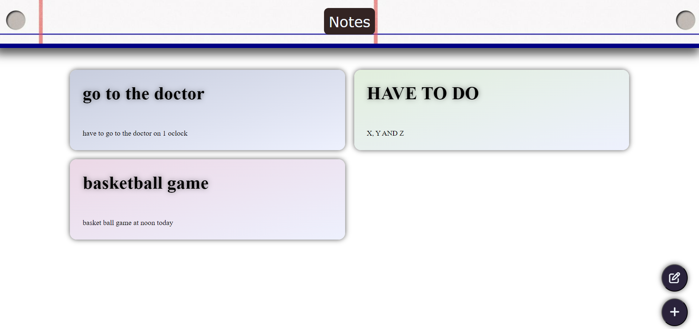
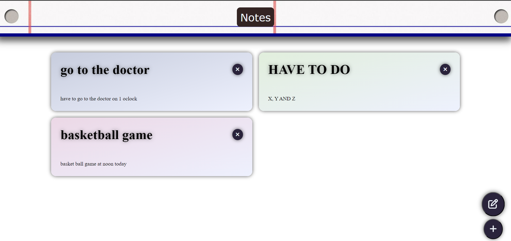
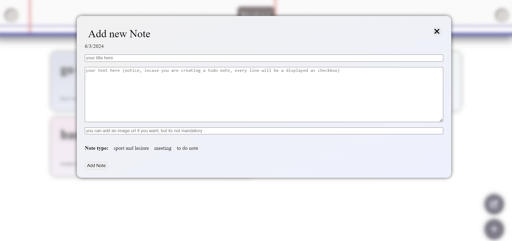
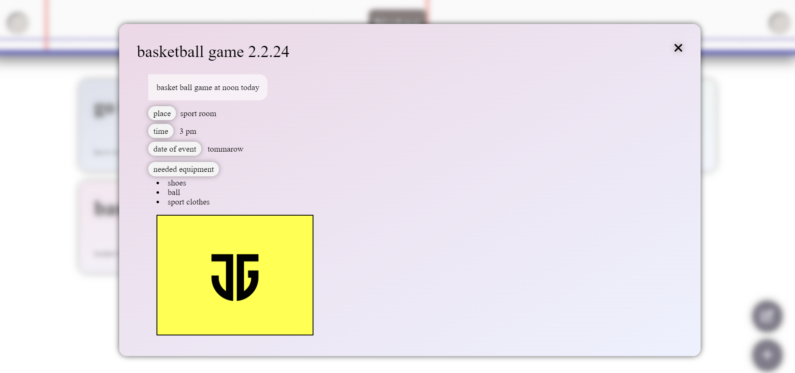
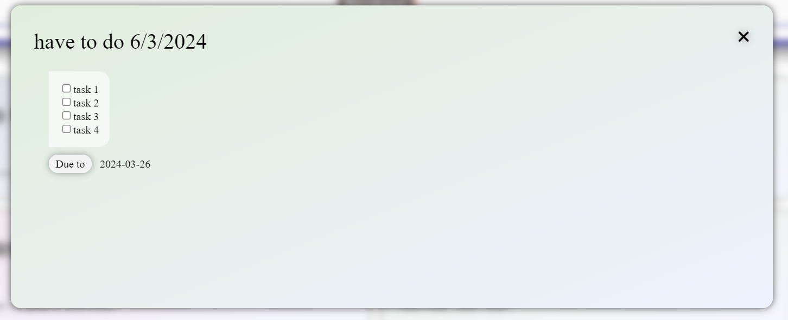
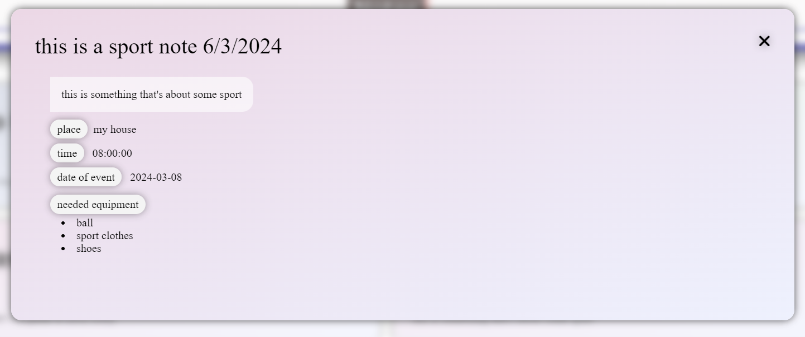
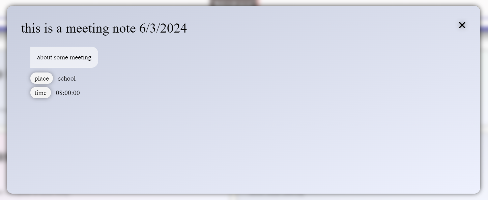

# Notes TS app

### view your notes on the main page

##
### remove notes by clicking the edit button (edit mode)

##
### add new note by clicking the plus button

### when adding notes :

- you have to choose a type
- you have to fill in the title and content
- image is not mandatory
- extra data will be shown only after choosing a type

> **notice!** it is not mendatory to fill in the extra details and a default value will be saved if you wouldn't fill it

> **if you entered something that is not an image src at the image url input box the image won't be saved (you'll get an alert and url line will be cleared)**

> in case of having a note with a broken image, the broken image symbol will not be visible (notice that the default list of notes includes broken src's)

##

### view your note by simply clicking on it

> for each type of note there's a different format:
#### to do note:

#### sport note:

#### meeting note:

